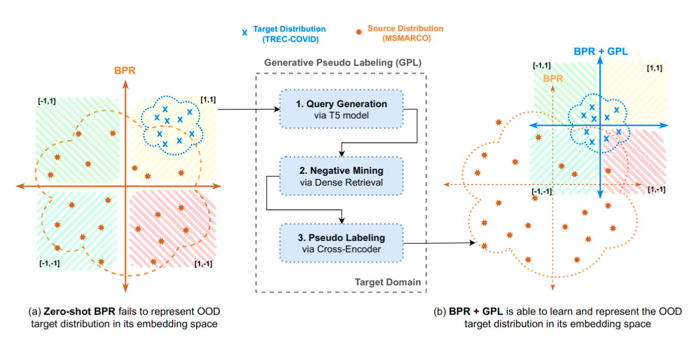

<h1 style="text-align:center">

</h1>

## :dollar: What is it?
Index Compression Methods (INCOME) repository helps you easily train and evaluate different **memory efficient** dense retrievers across any custom dataset. The pre-trained models produce float embeddings of sizes from 512 to even upto 1024. However, when storing a large number of embeddings, this requires quite a lot of memory / storage. We focus on index compression and produce final embeddings which are binary and require less dimensions which help you **save both storage and money** on hosting such models in practical setup.

We currently support the following memory efficient dense retriever model architectures: 
- [BPR: Binary Passage Retriever](https://aclanthology.org/2021.acl-short.123/) (ACL 2021)
- [JPQ: Jointly Optimizing Query Encoder and Product Quantization to Improve Retrieval Performance](https://dl.acm.org/doi/10.1145/3459637.3482358) (CIKM 2021)

For more information, checkout our publication:
- [Domain Adaptation for Memory-Efficient Dense Retrieval](https://arxiv.org/abs/2205.11498/) (Arxiv preprint)


## :dollar: Installation
One can either install income via `pip`
```bash
pip install income
```
or via source using `git clone`
```bash
$ git clone https://github.com/Nthakur20/income.git
$ cd income
$ pip install -e .
```
With that, you should be ready to go!

## :dollar: Models Supported

We currently support training and inference of these compressed dense retrievers within our repository:

|   | Models (on HF)| BEIR (Avg. NDCG@10) | Memory Size | Query Time | GCP Cloud | Cost per. Month (in \$) |
|:---:|:----:|:----:|:----:|:----:|:----:|:----:|
| **No Compression** |
| TAS-B [(Hofstatter et al., 2021)](https://arxiv.org/abs/2104.06967) | [TAS-B](https://huggingface.co/sentence-transformers/msmarco-distilbert-base-tas-b) | 0.415 | 65 GB (1x) | 456.9 ms | n2-highmem-8 | \$306.05 |   
| TAS-B + HNSW [(Hofstatter et al., 2021)](https://arxiv.org/abs/2104.06967) | [TAS-B](https://huggingface.co/sentence-transformers/msmarco-distilbert-base-tas-b) | 0.415 | 151 GB (1x) | 1.8 ms | n2-highmem-32 | \$1224.19 |
| TAS-B + PQ [(Hofstatter et al., 2021)](https://arxiv.org/abs/2104.06967) | [TAS-B](https://huggingface.co/sentence-transformers/msmarco-distilbert-base-tas-b) | 0.361 | 2 GB (32x) | 44.0 ms | n1-standard-1 | \$24.27 |   
| **Supervised Compression** |
| BPR [(Yamada et al., 2021)](https://aclanthology.org/2021.acl-short.123/) | [NQ (DPR)]() | 0.201 | 2.2 GB (32x) | 38.1 ms | n1-standard-1 | \$24.27 |
| BPR [(Thakur et al., 2022)](https://arxiv.org/abs/2205.11498) | [TAS-B](https://huggingface.co/nthakur20/bpr-base-msmarco-distilbert-tas-b)  |  **0.357** | 2.2 GB (32x) | 38.1 ms |n1-standard-1 | \$24.27 |
| JPQ [(Zhan et al., 2021)](https://dl.acm.org/doi/10.1145/3459637.3482358) | STAR [(query)](https://huggingface.co/nthakur20/jpq-question_encoder-base-msmarco-roberta-star) [(doc)](https://huggingface.co/nthakur20/jpq-document_encoder-base-msmarco-roberta-star) | 0.389 | 2.2 GB (32x) | 44.0 ms | n1-standard-1 | \$24.27 |
| JPQ [(Thakur et al., 2022)](https://arxiv.org/abs/2205.11498) | TAS-B [(query)](https://huggingface.co/nthakur20/jpq-question_encoder-base-msmarco-distilbert-tas-b) [(doc)](https://huggingface.co/nthakur20/jpq-document_encoder-base-msmarco-distilbert-tas-b)  | **0.402** | 2.2 GB (32x) | 44.0 ms | n1-standard-1 | \$24.27 |

The Index size and costs are estimated for a user who wants to build a semantic search engine over the English Wikipedia containing about 21 million passages you need to encode. 
Using float32 (and no further compression techniques) and 768 dimensions, the resulting embeddings have a size of about 65GB. The ``n2-highmem-8`` server can provide upto 64 GB of memory, whereas the ``n1-standard-1`` server can provide upto 3.75 GB of memory. 

## :dollar: Reproduction Scripts with TAS-B

|   | Script | BEIR (Avg. NDCG@10) | Memory Size |
|:---:|:----:|:----:|:----:|
| **Baselines** |
| fp-16 | [evaluate_fp16.py](https://github.com/NThakur20/income/blob/development/examples/baselines/evaluate_fp16.py) | 0.414  | 33 GB (2x)   |
| fp-8 | [evaluate_fp16.py](https://github.com/NThakur20/income/blob/development/examples/baselines/evaluate_fp16.py)  | 0.407  | 16 GB (4x)   |
| PCA  | [evaluate_pca.py](https://github.com/NThakur20/income/blob/development/examples/baselines/evaluate_pca.py)    | 0.235  | 22 GB (3x)   |
| TLDR | [evaluate_pca.py](https://github.com/NThakur20/income/blob/development/examples/baselines/evaluate_pca.py)    | 0.240  | 22 GB (3x)   |
| PQ   | [evaluate_pq.py](https://github.com/NThakur20/income/blob/development/examples/baselines/evaluate_pq.py)      | 0.361  | 2.2 GB (32x) |    
| **Supervised Compression**|
| BPR   | [bpr_beir_evaluation.py](https://github.com/NThakur20/income/blob/development/examples/bpr/evaluation/bpr_beir_evaluation.py) | 0.357  | 2.2 GB (32x) |
| JPQ   | [jpq_beir_evaluation.py](https://github.com/NThakur20/income/blob/development/examples/jpq/evaluation/jpq_beir_evaluation.py) | 0.402  | 2.2 GB (32x) |


## :dollar: Why should we do domain adaptation?




|   | Script | BEIR (Avg. NDCG@10) | Memory Size |
|:---:|:----:|:----:|:----:|   
| **Supervised Compression**|
| BPR+GenQ  | [train_bpr_genq.sh](https://github.com/NThakur20/income/blob/development/examples/bpr/training/train_bpr_genq.sh) | 0.377 | 2.2 GB (32x) |
| BPR+GPL   | [train_bpr_gpl.sh](https://github.com/NThakur20/income/blob/development/examples/bpr/training/train_bpr_gpl.sh) | 0.398  | 2.2 GB (32x) |
| JPQ+GenQ  | [train_jpq_genq.sh](https://github.com/NThakur20/income/blob/development/examples/jpq/training/train_jpq_genq.sh) | 0.417 | 2.2 GB (32x) |
| JPQ+GPL   | [train_jpq_gpl.sh](https://github.com/NThakur20/income/blob/development/examples/jpq/training/train_jpq_gpl.sh) | 0.435  | 2.2 GB (32x) |


## :dollar: Why should we do domain adaptation?


## :dollar: Inference


## :dollar: Training

### :dollar: BPR

```bash
export dataset="nfcorpus"

python -m income.bpr.train \
    --path_to_generated_data "generated/$dataset" \
    --base_ckpt "msmarco-distilbert-base-tas-b" \
    --gpl_score_function "dot" \
    --batch_size_gpl 32 \
    --gpl_steps 10000 \
    --new_size -1 \
    --queries_per_passage -1 \
    --output_dir "output/$dataset" \
    --generator "BeIR/query-gen-msmarco-t5-base-v1" \
    --retrievers "msmarco-distilbert-base-tas-b" "msmarco-distilbert-base-v3" "msmarco-MiniLM-L-6-v3" \
    --retriever_score_functions "dot" "cos_sim" "cos_sim" \
    --cross_encoder "cross-encoder/ms-marco-MiniLM-L-6-v2" \
    --qgen_prefix "gen-t5-base-2-epoch-default-lr-3-ques" \
    --evaluation_data "./$dataset" \
    --evaluation_output "evaluation/$dataset" \
    --do_evaluation \
    --use_amp   # Use this for efficient training if the machine supports AMP
```

### :dollar: JPQ


### :dollar: Disclaimer

For reproducibility purposes, we work with the original code repositories and modify them in INCOME if they available, for eg. [BPR](https://github.com/studio-ousia/bpr) and [JPQ](https://github.com/jingtaozhan/JPQ). It remains the user's responsibility to determine whether you as a user have permission to use the original models and to cite the right owner of each model. Check the below table for reference.

If you're a model owner and wish to update any part of it, or do not want your model to be included in this library, feel free to post an issue here or make a pull request!

| Model/Method | Citation | GitHub |
|:---:|:----:|:----:|
| BPR | [(Yamada et al., 2021)](https://aclanthology.org/2021.acl-short.123/) | [https://github.com/studio-ousia/bpr](https://github.com/studio-ousia/bpr) |
| JPQ | [(Zhan et al., 2021)](https://dl.acm.org/doi/10.1145/3459637.3482358) | [https://github.com/jingtaozhan/JPQ](https://github.com/jingtaozhan/JPQ) |
| GPL | [(Wang et al., 2021)](https://arxiv.org/abs/2112.07577) | [https://github.com/UKPLab/gpl](https://github.com/UKPLab/gpl)|


## :dollar: Citing & Authors
If you find this repository helpful, feel free to cite our recent publication: [Domain Adaptation for Memory-Efficient Dense Retrieval](https://arxiv.org/abs/2205.11498/):

```
@article{thakur2022domain,
  title={Domain Adaptation for Memory-Efficient Dense Retrieval},
  author={Thakur, Nandan and Reimers, Nils and Lin, Jimmy},
  journal={arXiv preprint arXiv:2205.11498},
  year={2022},
  url={https://arxiv.org/abs/2205.11498/}
}
```

The main contributors of this repository are:
- [Nandan Thakur](https://github.com/Nthakur20), Personal Website: [nandan-thakur.com](https://nandan-thakur.com)

Contact person: Nandan Thakur, [nandant@gmail.com](mailto:nandant@gmail.com)

Don't hesitate to send us an e-mail or report an issue, if something is broken (and it shouldn't be) or if you have further questions.

> This repository contains experimental software and is published for the sole purpose of giving additional background details on the respective publication.